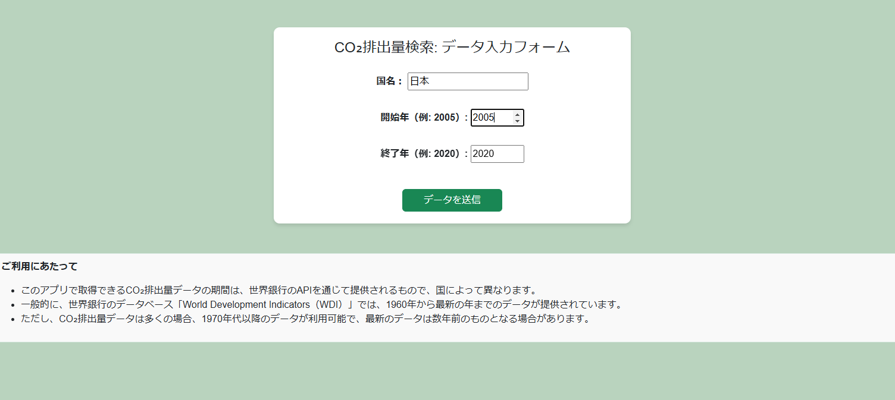
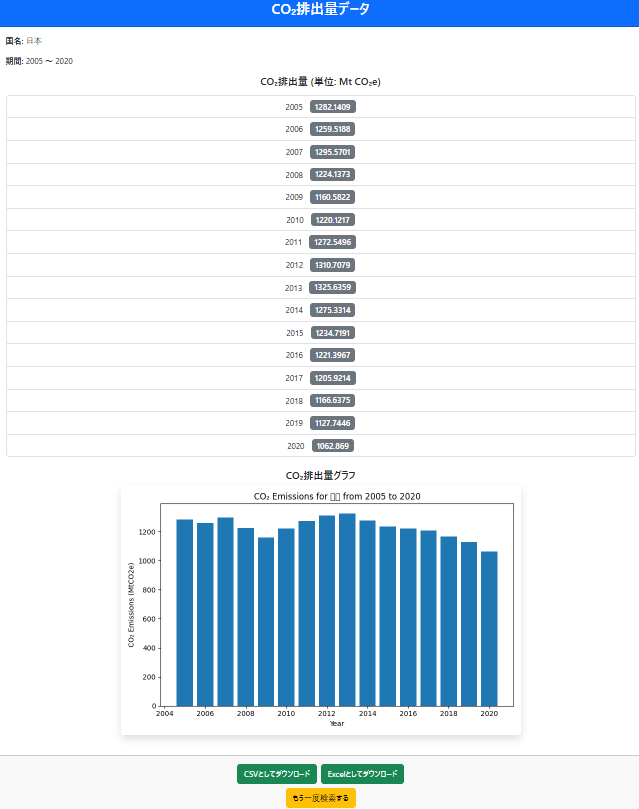
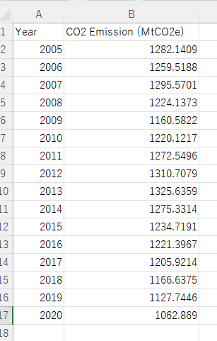
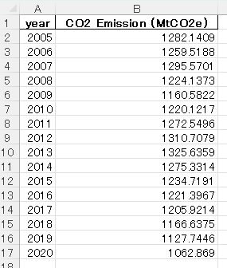
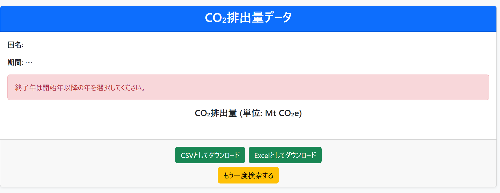
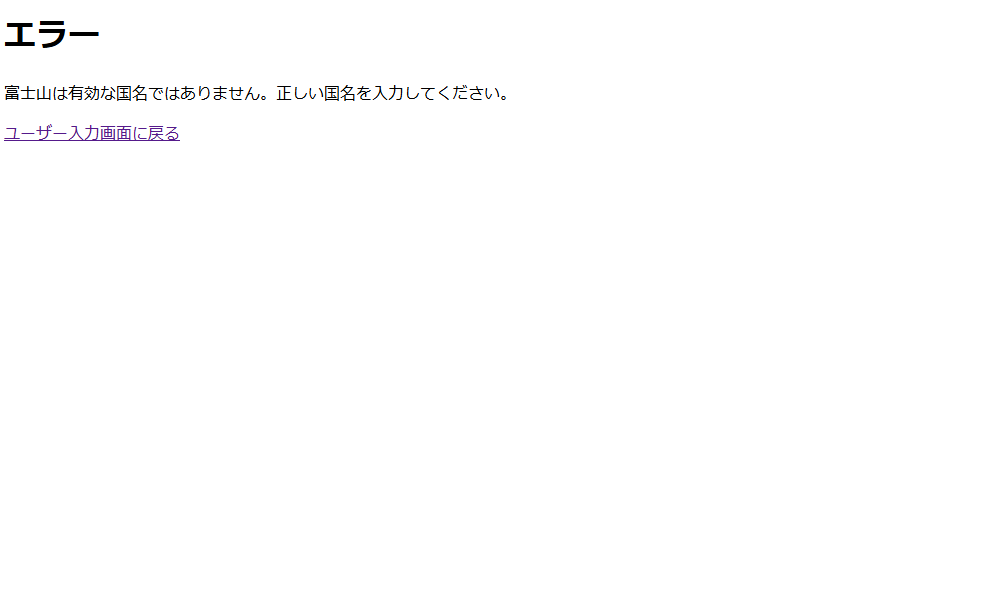

# CO₂ Emission Data Visualizer  
このアプリケーションは、CO₂排出データを可視化するツールです。  
指定した国、指定した開始年から終了年までのCO₂排出量データを取得してグラフに表示します。  
データはCSVやExcelファイルでダウンロードできます。

## アプリのデプロイ先
以下のURLでアプリを利用できます：  
https://co2-viz-b6d8014c247d.herokuapp.com

## 主な機能
- 国名の入力、プルダウンで期間の指定
- 取得したデータを表、およびグラフで表示
- データをCSV/Excel形式でダウンロード可能
- エラーメッセージ表示機能（不正な入力の場合）

## アプリのスクリーンショット

### メインページ



### 結果画面



### CSV画面



### Excel画面



### エラー画面





## 動作環境
このアプリは、以下の環境で動作します。

- **OS**: 任意のOS（Windows, macOS, Linux）
- **Python**: 3.x
- **ライブラリ**: 以下のPythonパッケージが必要です。
  - Django
  - Requests
  - その他、`requirements.txt` に記載の依存関係


## インストール方法

以下の手順に従って、ローカル環境にアプリをインストールし、実行できます。

1. GitHubリポジトリをローカルにクローンします。
```bash  
https://github.com/TechCat-Hello/co2_viz.git  
cd your-repository
```

2. Pythonの仮想環境を作成します。  
```bash  
python3 -m venv venv
```

3. 仮想環境を有効化します。
- Windowsの場合
```bash  
venv\Scripts\activate
```

- Mac/Linuxの場合
```bash  
source venv/bin/activate
```

4. 必要な依存関係をインストールします。  
次に、requirements.txtに記載されている依存関係をインストールします。 
```bash  
pip install -r requirements.txt
```

5. .envファイルの設定をします。  
アプリケーションがAPIにアクセスするために必要なAPIキーを設定します。    
プロジェクトのルートディレクトリに.envという名前のファイルを作成し、以下の内容を `.env` ファイルに追加してください。  
```env
DEBUG=False
DJANGO_SECRET_KEY=your_django_secret_key
DJANGO_ALLOWED_HOSTS=your_allowed_hosts  
```

6. アプリケーションをローカルで実行します。  
```bash  
python manage.py runserver
```  

7. ブラウザで http://127.0.0.1:8000 にアクセスして、アプリを確認します。


## 使い方
1. 検索したい国の名前を日本語で入力します。
2. 開始年と終了年をプルダウンで選択します。
3. 「データを送信」ボタンをクリックして結果を確認します。
4. データをダウンロードする場合、画面下部の「CSVとしてダウンロード」または「Excelとしてダウンロード」ボタンをクリックします。

## License
This project is licensed under the MIT License.  
See the [MIT License](https://github.com/TechCat-Hello/co2_viz/blob/main/LICENSE) file for more details.

## Contributing
私はこのプロジェクトを公開しています。  
もしこのプロジェクトに貢献したい場合は、以下の手順に従ってください：  
1. リポジトリをフォークする   
プロジェクトに貢献したい場合は、まずリポジトリをフォークしてください。  
GitHubでリポジトリのページを開き、右上にある「Fork」ボタンをクリックしてください。  

2. 新しいブランチを作成する    
フォークしたリポジトリをローカルにクローンし、新しいブランチを作成してください。  
例えば、feature/新しい機能 や bugfix/バグ修正 などの名前をつけると良いです。  
```bash  
git checkout -b feature/新しい機能
```

3. コードを変更する    
バグ修正や新機能の追加、改善を行います

4. 変更をコミットする  
変更が完了したら、変更内容をコミットします。  
コミットメッセージは簡潔で、変更内容を説明するものにしましょう。  
```bash  
git add .
git commit -m "Fix issue with temperature calculation logic"
```

5. プルリクエストを作成する  
変更をローカルリポジトリでコミットした後、GitHubの自分のリポジトリにプッシュして、元のリポジトリにプルリクエストを作成します。  
```bash  
git push origin feature/新しい機能
```

6. プルリクエストを送信する  
GitHub上で、あなたのリポジトリのページを開き、「Pull Requests」タブから新しいプルリクエストを作成します。  
説明文も詳しく記載し、変更内容を他の人が理解できるようにしてください。  

## Issueの報告
もしバグを発見した場合や、新しい機能の提案がある場合は、Issues を使って報告してください。  
以下の情報を含めて報告していただけると、より迅速に対応できます：  
- バグの再現手順
- エラーメッセージ（あれば）
- 提案内容や機能追加の理由

## コードスタイル
コードは以下のスタイルガイドに従ってください：  
- PythonのPEP 8スタイルガイドに従う
- インデントにはスペース4つを使用
- 変数名や関数名はわかりやすく意味のある名前を使用

## その他の注意事項
- テスト:   
新しい機能を追加した場合やバグを修正した場合は、テストを追加していただけると助かります。
- レビュー:  
プルリクエストは、できるだけ小さく簡潔にしてください。レビューがしやすくなります。

## 作者
- 名前: TechCat-Hello  
- GitHub: [TechCat-Hello](https://github.com/TechCat-Hello)
- Email: a.m.techcat@gmail.com

## Thank You!
このプロジェクトへの貢献をありがとうございます！  
あなたの貢献がプロジェクトをさらに素晴らしいものにします。


